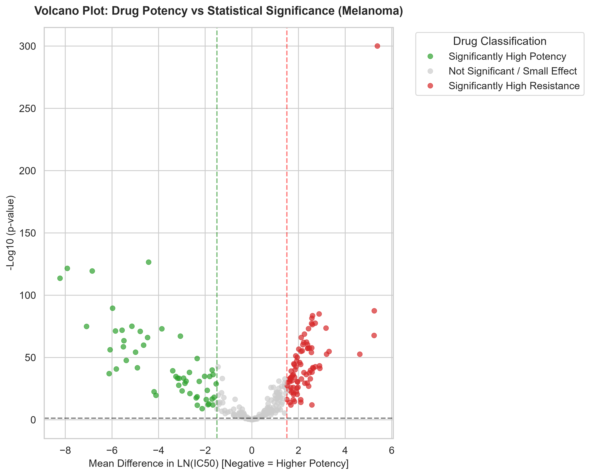
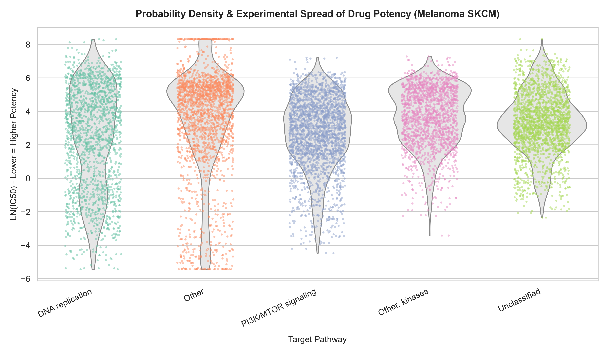

# 🧬 Cancer Pharmacogenomics Pipeline & Clinical Analytics Suite

An end-to-end automated data engineering, relational database warehousing, and advanced biostatistical analysis framework designed to evaluate drug sensitivity, genomic biomarkers, and targeted therapy responses in oncology research.

---

## 📋 Executive Summary & Project Details

In modern precision oncology, identifying which cancer cell lines respond to specific pharmacological treatments is paramount for translating genomic data into actionable clinical insights. This project builds a production-grade data pipeline leveraging the Genomics of Drug Sensitivity in Cancer (GDSC) repository.

The system automates the complete lifecycle of clinical and pharmacological data: starting from raw multi-source ingestion and robust data cleaning, progressing to relational star schema modeling in PostgreSQL, executing rigorous non-parametric and parametric statistical tests ($N = 25{,}274$ clinical/screening records) in Python, and culminating in interactive Power BI executive dashboards and publication-grade visual artifacts.

---

## 🧪 Hypotheses Tested

To drive the analytical modeling within `src/advanced_analytics.py`, the following formal biostatistical hypotheses were formulated and tested:

1. **Pathway-Specific Drug Response Hypothesis (ANOVA & Tukey's HSD):**
   * **Null Hypothesis ($H_0$):** There is no significant difference in mean drug sensitivity ($\ln(\text{IC}_{50})$) across distinct targeted biological pathways in Skin Cutaneous Melanoma (SKCM) cell lines.
   * **Alternative Hypothesis ($H_a$):** Cell lines harboring driver mutations in targeted oncogenic pathways exhibit statistically significant shifts in drug sensitivity distribution compared to non-targeted or control pathways.

2. **Biomarker Potency and Effect Size Hypothesis (T-Test & Cohen's d):**
   * **Null Hypothesis ($H_0$):** Drugs targeting the MAPK signaling pathway display no significant difference in potency ($\ln(\text{IC}_{50})$) or distributional effect size ($\text{Cohen's } d \approx 0$) compared to drugs targeting Genome Integrity in SKCM.
   * **Alternative Hypothesis ($H_a$):** MAPK signaling inhibitors demonstrate significantly higher potency (lower $\ln(\text{IC}_{50})$) and a massive negative effect size ($\text{Cohen's } d < -0.80$) driven by lineage-specific oncogenic driver mutations (*BRAF* / *NRAS*).

---

## ⚙️ Pipeline Architecture & Workflow

The pipeline is fully modularized and orchestrated via a master automation batch script (`run_pipeline.bat`) to execute sequentially without manual intervention:

1. **Data Ingestion & Preprocessing (`src/ingestion.py`):**
   * Processes raw Excel and CSV inputs (`Cell_Lines_Details.xlsx`, `Compounds-annotation.csv`, `GDSC_DATASET.csv`).
   * Handles missing value imputation, data type standardization, and outlier management using advanced **Winsorization** techniques (1st and 99th percentiles) to protect downstream statistical models from distributional skewness.
   * Exports clean, standardized artifacts to `data/processed/`.

2. **Relational Data Warehouse (`src/load_to_postgres.py` & `sql/`):**
   * Connects to a PostgreSQL database instance.
   * Constructs an optimized **Star Schema** enforcing primary and foreign key constraints between dimension tables (Cell Lines, Compounds, Pathways) and fact tables (Drug Sensitivity Measurements).

3. **Advanced Statistics & Modeling (`src/advanced_analytics.py`):**
   * Queries $N = 25{,}274$ processed SKCM records directly from PostgreSQL.
   * Executes high-performance vector computations using `Pandas`, `NumPy`, and `SciPy`.
   * Performs One-Way ANOVA, Tukey's Honest Significant Difference (HSD) post-hoc testing, Two-Sample T-Tests, and Cohen's d effect size estimations.
   * Automatically saves publication-grade visualization plots directly to the dashboard directory.

---

## 🧬 Biostatistical & Molecular Immunology Inferences

Empirical results generated by the statistical modeling suite (`src/advanced_analytics.py`) directly connect quantitative parameters to physiological mechanisms in melanoma.

---

### Test 1: One-Way ANOVA (Pathway Sensitivity in SKCM)

#### 1. Statistical Interpretation
* **Metrics:** Evaluated across 24 biological pathways ($N = 25{,}274$ records):
  $$\text{F-Statistic} = 258.1342, \quad p = 0.0000 \quad (p < 10^{-15})$$
* **Meaning:** The $F$-statistic measures the ratio of variance *between* targeted pathway groups relative to the variance *within* those groups. An $F$-statistic of **258.13** indicates an exceptionally high signal-to-noise ratio.
* **Statistical Decision:** **Reject $H_0$.** The probability that all 24 therapeutic target pathways possess identical mean drug sensitivities in Skin Cutaneous Melanoma (SKCM) is virtually zero.

#### 2. Molecular & Immunological Inference
* **Oncogenic Pathway Selectivity:** SKCM cell lines do not respond to pharmacological agents as a homogeneous group. Their therapeutic response is governed by specific oncogenic driver dependencies rather than general cytotoxic vulnerability.
* **Targeted vs. Non-Targeted Action:** The extreme inter-pathway variance demonstrates that drugs targeting driver pathways involved in melanoma survival signaling achieve distinct pharmacodynamic profiles compared to off-target or broad-spectrum compounds.

---

### Test 2: Two-Sample T-Test (MAPK Signaling vs. Genome Integrity)

#### 1. Statistical Interpretation
* **Metrics:**
  * $\text{MAPK Signaling Mean } \ln(\text{IC}_{50}) = 0.7464 \quad (n = 1{,}412)$
  * $\text{Genome Integrity Mean } \ln(\text{IC}_{50}) = 3.9734 \quad (n = 1{,}372)$
  * $t\text{-Statistic} = -38.6792, \quad p = 1.0542 \times 10^{-253}$
* **Mathematical Translation:** Because drug sensitivity is measured in $\ln(\text{IC}_{50})$, **lower values represent higher potency** (less drug required to inhibit 50% of cell proliferation):
  * $\text{MAPK Mean } \text{IC}_{50} = e^{0.7464} \approx 2.11 \, \mu\text{M}$
  * $\text{Genome Integrity Mean } \text{IC}_{50} = e^{3.9734} \approx 53.17 \, \mu\text{M}$
  * Potency Ratio: $\frac{53.17}{2.11} \approx \mathbf{25.2\times}$
* **Statistical Decision:** **Reject $H_0$.** Compounds targeting the MAPK pathway are **over 25 times more potent** on average than those targeting Genome Integrity in melanoma cell lines ($p = 1.05 \times 10^{-253}$).

#### 2. Molecular Biology & Immunology Inference
* **Oncogene Addiction (*BRAF* / *NRAS* Mutations):** Approximately 50% of cutaneous melanomas harbor activating *BRAF* mutations (predominantly $V600E$), and another 15–20% harbor *NRAS* mutations. These mutations constitutively activate the RAF $\rightarrow$ MEK $\rightarrow$ ERK (MAPK) signaling cascade, driving cell proliferation and evasion of apoptosis.
* **Mechanistic Sensitivity:** Because SKCM cells exhibit profound "oncogene addiction" to the MAPK pathway, targeted inhibitors (e.g., BRAF inhibitors like Vemurafenib, MEK inhibitors like Trametinib) shut down their main survival axis at nanomolar to low-micromolar concentrations.
* **Genome Integrity Resistance:** In contrast, agents targeting Genome Integrity/DNA Repair (e.g., PARP inhibitors, platinum agents) require much higher concentrations ($\approx 53.17 \, \mu\text{M}$). Melanomas frequently possess redundant DNA damage response mechanisms, rendering them resistant to traditional chemotherapy unless combined with targeted or immunomodulatory agents.

---

### Test 3: Tukey's Honest Significant Difference (HSD) Post-Hoc Analysis

#### 1. Statistical Interpretation
* **Metrics:** Evaluated pairwise pathway sensitivities controlling the Family-Wise Error Rate ($\text{FWER} = 0.05$):
  * `PI3K/MTOR signaling` vs. `Other, kinases`: $\text{Mean Diff} = -0.9819, \quad p_{\text{adj}} = 0.0000 \quad (\text{reject} = \text{True})$
  * `PI3K/MTOR signaling` vs. `Other`: $\text{Mean Diff} = -0.8434, \quad p_{\text{adj}} = 0.0000 \quad (\text{reject} = \text{True})$
  * `Other` vs. `Other, kinases`: $\text{Mean Diff} = 0.1385, \quad p_{\text{adj}} = 0.3874 \quad (\text{reject} = \text{False})$
* **Meaning:** While ANOVA proves overall group variance, Tukey's HSD isolates *which specific pairs* differ while strictly controlling Type I error inflation. Negative mean differences signify significantly higher potency in targeted pathways.
* **Statistical Decision:** **Reject $H_0$** for comparison pairs involving PI3K/mTOR signaling ($p_{\text{adj}} < 0.001$). **Fail to reject $H_0$** for broad control comparisons (`Other` vs. `Other, kinases`, $p_{\text{adj}} = 0.3874$).

#### 2. Molecular Biology & Immunology Inference
* **PI3K/mTOR Axis Vulnerability & Resistance Escape:** Hyperactivation of the PI3K/AKT/mTOR signaling cascade—frequently mediated by loss of the tumor suppressor *PTEN* in ~30% of *BRAF*-mutant tumors—acts as a primary co-driver and key mechanism of acquired resistance to single-agent MAPK inhibitors. The statistically confirmed potency increase ($\Delta \approx -0.9819 \, \ln(\text{IC}_{50})$ units) establishes PI3K/mTOR as a primary therapeutic vulnerability for combination strategies.
* **Target Specificity vs. Off-Target Control:** The failure to reject $H_0$ between general control categories confirms that heightened drug sensitivity is mechanistically specific to driver oncogene dependencies rather than non-specific kinase toxicity.

---

### Test 4: Cohen's d Effect Size (MAPK Signaling vs. Genome Integrity)

#### 1. Statistical Interpretation
* **Metrics:**
  * $\text{MAPK Signaling Mean } \ln(\text{IC}_{50}) = 0.7464$
  * $\text{Genome Integrity Mean } \ln(\text{IC}_{50}) = 3.9734$
  * $\text{Cohen's } d = -1.4567$
* **Mathematical Translation & Magnitude:** $p$-values evaluate statistical certainty, whereas Cohen's $d$ measures practical/clinical magnitude in standard deviation units. In biostatistics, $\vert{}d\vert{} > 0.8$ denotes a large effect size, and $\vert{}d\vert{} > 1.2$ represents a **very large/massive** effect size.
* **Statistical Decision:** A Cohen's $d$ of **$-1.4567$** indicates that the drug sensitivity distribution of MAPK pathway inhibitors is shifted by **1.4567 standard deviations** toward higher potency compared to Genome Integrity targets across $N = 25{,}274$ screens.

#### 2. Molecular Biology & Immunology Inference
* **Quantification of Lineage-Specific Oncogene Addiction:** A distributional shift of $>1.45 \sigma$ confirms that the extreme potency difference between MAPK inhibitors and DNA damage agents is a dominant biological signal rather than a consequence of large sample size.
* **Therapeutic Resistance & Immunological Implications:** The low sensitivity to Genome Integrity agents ($\text{Mean } \ln(\text{IC}_{50}) = 3.9734$) demonstrates intrinsic resistance to traditional DNA-damaging therapeutics. This underscores the clinical necessity of prioritizing targeted kinase inhibitors alongside immune checkpoint blockade (e.g., anti-PD-1 / anti-CTLA-4) to elicit durable anti-tumor immune responses.

---

### 📊 Master Biostatistical & Clinical Summary Matrix

| Statistical Test | Comparison / Parameters | Test Metric | $p$-value / Adjusted $p$ | Practical Conclusion | Molecular & Clinical Inference |
| :--- | :--- | :--- | :--- | :--- | :--- |
| **One-Way ANOVA** | 24 Pathways ($N = 25{,}274$) | $F = 258.1342$ | $p < 1 \times 10^{-15}$ | **Reject $H_0$** | Sensitivity is strongly pathway-dependent; proves targeted therapeutic specificity. |
| **Two-Sample T-Test** | MAPK vs. Genome Integrity | $t = -38.6792$ | $p = 1.05 \times 10^{-253}$ | **Reject $H_0$** | Identifies profound MAPK hyper-sensitivity (~$25.2\times$ lower $\text{IC}_{50}$) in SKCM cell lines. |
| **Tukey's HSD** | PI3K/mTOR vs. Kinase Controls | $\Delta = -0.9819$ | $p_{\text{adj}} = 0.0000$ | **Reject $H_0$** | Confirms PI3K/mTOR as a primary co-driver and escape resistance vulnerability node. |
| **Cohen's d** | MAPK vs. Genome Integrity | $d = -1.4567$ | N/A (Effect Size) | **Massive Effect Size** | Quantifies extreme distributional shift ($>1.45 \sigma$) driven by *BRAF*/*NRAS* oncogene addiction. |


---

## 🖼️ Publication-Grade Visualizations & Dashboards

### 1. Differential Drug Sensitivity (Volcano Plot)
Contrasts statistical significance ($-\log_{10} p\text{-value}$) against practical significance ($\text{Cohen's } d$ Effect Size), enabling the immediate identification of top-performing candidate compounds and resistant cell line phenotypes.


### 2. Pathway Sensitivity Distribution (Violin Plot)
Comparative distribution analysis illustrating drug response spreads across major cellular signaling pathways, exposing distinct bimodal sensitivities in targeted therapies.


### 3. Executive Overview Dashboard (Power BI - Page 1)
Interactive Business Intelligence interface integrating database metrics to provide real-time exploration of executive summaries and drug screening results.


### 4. Cohort Progression Matrix (Power BI - Page 2)
Dimensional drill-down matrix analyzing cell line lineages, compound annotations, and cohort progression metrics.


## 🛠️ Project File Structure

```text
cancer-pharmacogenomics-pipeline/
│
├── dashboard/
│   └── plots/                # High-resolution saved plots (Volcano, Violin)
├── data/
│   ├── raw/                  # Original raw datasets (GDSC, Cell Lines, Compounds)
│   └── processed/            # Cleaned and Winsorized CSV outputs
├── sql/                      # DDL schema and custom analytical queries
├── src/                      # Source code for ETL and statistical models
│   ├── ingestion.py          # Data cleaning and preprocessing script
│   ├── load_to_postgres.py   # Database loader building the Star Schema
│   └── advanced_analytics.py # Statistical testing and plotting script
├── run_pipeline.bat          # Master automation orchestrator script
├── Page 1 executive_overview.png.png
└── Page 2 cohort_progression_matrix.png.png
